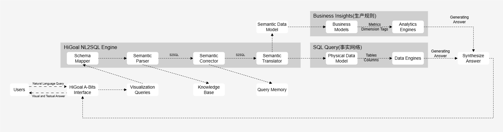

[English](./README.md) | [中文](./README_zh.md)
# HiGoalVita – Modular, Extensible, production-ready RAG & Agent platform

**HiGoalVita** is a production-ready Retrieval-Augmented Generation (RAG) suite. 
It delivers a full-stack solution including server, backend services, frontend UI, and asynchronous task pipelines,
 so users can pose natural-language queries to an LLM and receive answers grounded in their own customer data.

Originally developed and proven in commercial deployments by the HiGoal team, HiGoalVita is now open-sourced to empower the community with a flexible, production-grade RAG solution.
Our open-source framework is modular and extensible, with native integrations for Relational databases, Vector stores, and other operational modules.

---

## Table of Contents
- [Introduction](#introduction)
- [Architecture](#architecture)
- [Features](#features)
- [Open-Source Roadmap](#open-source-roadmap)
- [Getting Started](#quick-start)
- [Devloper Guide](#developer-guide)
- [License](#license)
- [About](#about)

---

<h2 id="introduction">📖 Introduction</h2>
Today’s explosion of LLMs and open-source RAG projects has made demo-level retrieval easy—yet building a robust, enterprise-grade system remains a huge lift. Most existing toolkits focus on lab environments or isolated pipelines, leaving companies to stitch together their own frontend, backend, database, and hosting stacks.

**HiGoalVita** fills that gap with a turnkey suite designed from day one for real-world operations. We provide everything an organization needs: 
a UI for end users; a scalable backend; relational and graph-backed knowledge stores; and smart agents that route queries and perform actions  

Under the hood, our proprietary graph-network algorithms ingest documents and data from multiple silos into a unified relational-graph database. This deep understanding of entities and relationships enables:  
- Context-aware answers
- Segmentation Network analysis
- Actionable workflows with multi-agents

By combining RAG, intelligent agents, and graph-based indexing, HiGoalVita transforms scattered corporate data into a smart, conversational knowledge assistant—ready for enterprise scale, security, and real-time decision support.  


---
<h2 id="architecture">⚒️ Architecture</h2>

<p style="margin: 20px 0;">
  
</p>

### Components:
  - Data Layer: Data Sources/Metadata Storage/LLM Gateway/Vector Database/Indexing Jobs/API Server
  - Core Services Layer: Enterprise Knowledge Base/Digital Employees/Service Agents/Customer-facing Intelligent Routing
  - Product Layer: Corpus Engineering/Prompt Engineering/Application Tools Layer/Pluggable Agent Plugins
  - Model Services Layer: Fine-tuning Framework/Vertical Domain Pre-training/Hybrid Deployment
  - Interaction Layer: Web UI

    
<h2 id="features">✨ Features</h2>

- 🔍 RAG-Powered Retrieval with document embedding and retrieval
  - Interact with llm models, supporting both local llms or through APIs.
  - Answer based on customer data 
    - Customer documents are embedded and indexed, then retrieved on demand to ground every answer in your own data.
    - Process flat documents into a searchable knowledge store with structure and relations.
    - Persist every chat turn and system prompt into your database to enable fine-grained auditability, analytics, and iterative refinement.
    - Graph database powered indexing, search and answer (available in v3.0)  
- 🏗️ Production-Grade Backend
  - Built on FastAPI + Gunicorn, containerized with Docker/Docker-Compose, and horizontally scalable.
  - Asynchronous processing powered by FastAPI and Redis, with built-in health checks and metrics for observability.
  - Dockerized deployment. (available in v2.0)
  - Role-based authentication and per-query access levels to enforce secure, production deployments.  (available in v2.0)
- 🖥️ End-to-End Tooling
  - CLI commands for ingesting documents, building embeddings, running queries, and testing pipelines.
  - Web UI for interactive Q&A sessions.
  - Web UI for documents update, process, label. (available in v2.0)
  - Automatically logs every API call, user query, and LLM response 
- 🧩 Modular architecture and configurable components:
  - Databases: SQLite, MySQL, OceanBase
  - Vector Stores: LanceDB, OceanBase
  - Caching: in-memory, Redis, file-based
  - LLM Providers: OpenAI, DeepSeek, Qianwen
- 🤖 Agents:
  - NL2SQL natural-language questions to database queries (available in v2.0):
    - access, query, edit database.
    - automated analytics, plots, summaries.
  - Domain-Specific Agents (available in v3.0)
    - Prebuilt assistants with tailored and field-specific workflows.

---

<h2 id="open-source-roadmap">📌 Open-Source Roadmap</h2>

We are releasing this project in **incremental phases**, inviting the community to contribute and evolve the project with us.

### 🚀 Version 1.0 – Core RAG Foundation (Line-based)
The foundational release that delivers a fully integrated RAG engine combined with essential operational tooling—enabling teams to ingest, index, query, and deploy a robust retrieval-augmented system end to end.
- ✅ RAG-Powered Retrieval with relational DB indexing (SQLite/MySQL/OceanBase)
- ✅ Production-Grade Backend: FastAPI + Gunicorn, Redis
- ✅ CLI utilities for document ingestion, embedding builds, ad-hoc querying, and pipeline testing  
- ✅ Basic Web UI for single-session querying
- ✅ Persistent logging of system prompts, user queries & LLM responses for auditability  

---

### 🛡️ Version 2.0 – Operational Enhancements with database Agent
Elevates enterprise readiness with hardened deployments, bolting on security, and real-time streaming. 
And the introduction of our first AI agent for database operations.
- 🔜 Dockerized deployment for quick setup and consistency across environments  
- 🔜 Role-based access control & per-query permissions
- 🔜 Web UI update for document upload, processing, annotation, and labeling. Support Corpus/data source management.
- 🔜 WebSocket-based streaming output
- 🔜 NL2SQL agent: Execute SQL query to customer database with automated analytics, summaries, and visualization

---

### 🌐 Version 3.0 – Multi-domain Knowledge Graph and Agents Orchestration
Transforms the platform into a graph-native knowledge system with multi-hop reasoning and dynamic orchestration of specialized agents.
- 🔜 Support Graph database–backed retrieval & causal reasoning
- 🔜 Graph-driven link prediction, node classification, and recommendation engines
- 🔜 Prebuilt domain-specific agent templates
- 🔜 smart routing and real-time alignment for one or more domain-specific agents for each query  


---
## Getting Started
To unlock all of HiGoalVita’s capabilities, you’ll need:
1. **Python Engine**  
   The core RAG backend, FastAPI server, and CLI tools.  
2. **Intermediary Services**  
   Redis for caching, streaming status updates, and async support.
3. **Database**  
   SQLite, MySQL, or OceanBase to persist documents & metadata.

> ⚙️ **Tip:** If you only need the standalone CLI or API, you can skip Redis and use the built-in SQLite store.  
> See [docs/installation_guide.md](docs/installation_guide.md) for full setup instructions.


### Prerequisites
- **Python 3.10 - 3.12**  
- **Poetry** (for dependency management)  
- **Docker** (for the full suite)

### Quick Start - backend only
This quick start for backend only sets up the HiGoal Core Engine only — a lightweight, command-line–driven version of the system.
It is useful for local testing and development, does not require frontend, Redis, or external databases. 
```bash
# Clone the repository
git clone https://github.com/HiGoalV/HiGoalVita.git

# Use poetry for dependency management
poetry install

# Start the backend
higoalcore index
higoalcore query --query "this is a example question"

```
### Quick Start - Complete Suite

quick installation for complete suite
```bash
git clone https://github.com/HiGoalV/HiGoalVita.git
# Use poetry for dependency management
poetry install
# Install Redis
docker pull redis:latest
```
To execute it, following this: Start 
```bash
# Pull and run Redis container
docker run -d --name some-redis -p 6379:6379 redis:latest

# Start the backend in terminal(FastAPI)
uvicorn higoalengine.app.main:app

# Open a third terminal, call frontend
cd vue
npm run serve
```
---
## Developer Guide

HiGoalVita is designed to be modular and extensible across every layer of the stack.
Each component—frontend, backend, database, vector store, LLM, and agent logic—can be swapped, extended, or scaled independently.
Each module is loosely coupled, making it easy to customize or extend based on your enterprise needs.

We’re gradually releasing detailed documentation for each module. Stay tuned as more links become available.

Explore our available technical docs (more coming soon):
- [Frontend Interface](docs/frontend_api.md)  

---
## License

This project is licensed under the Apache License 2.0. See [LICENSE](LICENSE) for details.

---

## 💡 Acknowledgement

Licensed under the Microsoft open-source license, with gratitude for Microsoft's enduring support and contributions to developers worldwide.  

---

<h2 id="about">💼 About</h2>

**HiGoalVita** is developed and maintained by **HiGoalV Corporation**, a startup specializing in enterprise-grade AI solutions. Our team delivers end-to-end AI platforms for both B2B (enterprise) and B2C (consumer) markets. 

For commercial deployments, integrations, or partnership inquiries, please contact us at **zhuyang@higoall.com** or scan the QR code below.  <br>
We’re also hiring talented Software Engineers, BI Analysts, and AI Specialists—if you’d like to join our team, please don’t hesitate to reach out.

<table align="center">
  <tr>
    <td align="center">
      <br/>
      <sub>WeChat</sub>
    </td>
    <td width="60"></td> <!-- spacing -->
    <td align="center">
      <br/>
      <sub>TikTok</sub>
    </td>
  </tr>
</table>


